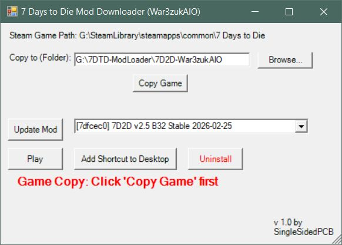
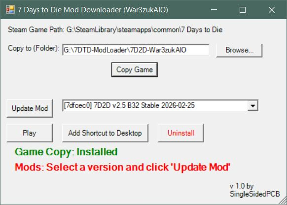
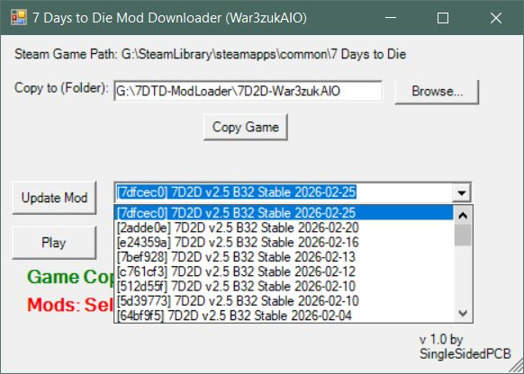
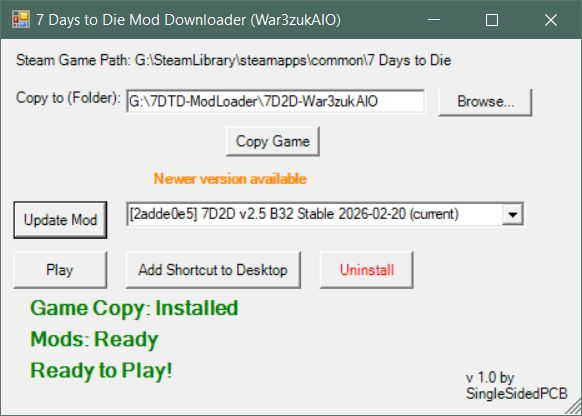

# 7D2D-ModLoader

7 Days to Die mod-pack downloader that uses Git to fetch and update large mod packs hosted on Git-compatible services (GitHub, Azure, etc.). Saves disk space, bandwidth, and update time by using Git to download only changes.

## Features
- Detects Steam installation of 7 Days to Die.
- Creates a separate copy of the game (mods are not installed into the Steam game directory).
- Uses a local Git repository for each mod pack for fast updates.
- Creates a symbolic link from the mod pack's Mods folder to the game copy's Mods folder.
- Notifies when new mod versions are available.
- Simple uninstall options for the game copy, local repo, or portable Git.

## Requirements
- Windows 10 with PowerShell 5 (tested).
- .NET (Windows Forms) for the GUI.
- Git (script will prompt to download/install Portable Git if absent).
- The correct 7 Days to Die Steam version for the mod pack.
- Run as Administrator the first time to allow creating the Mods symlink (run.bat starts PowerShell as Admin).

## Quick install
1. Create a new folder on a drive with enough free space.
2. Place both `ModLoader.ps1` and `run.bat` in that folder.
3. That's it.

## How to configure
1. Open `ModLoader.ps1` in a text editor (Notepad, Notepad++, etc.).
2. Edit the variables at the top:
   - `$modName` — name of the mod pack.
   - `$repoUrl` — Git URL of the mod pack.
3. Save.

## How to run
- Run the script as Administrator (right-click -> Run as administrator) or double-click `run.bat`.
- The PowerShell window and GUI will appear.

Default copy path: a subdirectory named `7DTD-<modname>` created where the script is run (you can change this in the GUI).

## First run behavior
- Locates Steam installation of 7 Days to Die.
- Suggests an install path for the local game copy.
- Copies the game to the chosen path (this is forced).
- Creates a local Git repo for the mod pack and downloads the mod.
- Creates a symbolic link from the mod pack's Mods folder into the local game copy's Mods folder.

## Subsequent runs
- Remembers the game copy path and installed mod version.
- Notifies you if a new mod version is available.
- Updates are fast since only changes are downloaded.

## Uninstall
Use the Uninstall button in the GUI to remove:
- The game copy,
- The local repo for the mod pack,
- Portable Git (if installed).

Manually deleting these folders is also supported; the script will detect missing folders.

## Usage notes
- Ensure you have enough free space for a full game copy plus the mod pack.
- Custom files and folders in the Mods directory will be safe as long as their name doesnt conflict with something in the Mod Pack

## Screenshots
  
   

## Other
- The intention for this is to be used with 7 Days to Die but it should support any Steam Game that has Mod Packs hosted on Git
- All important settings are at the top of the script, easily editable for any game. the only exception is the Mods path is hard coded.
- If i learn of other games this can work for that store mods in a different path, i'll edit the script to make the Mods path a variable.

## License
MIT License, see LICENSE file
Copyright (c) 2026 SingleSidedPCB
